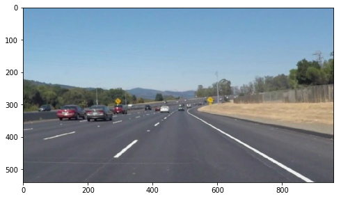
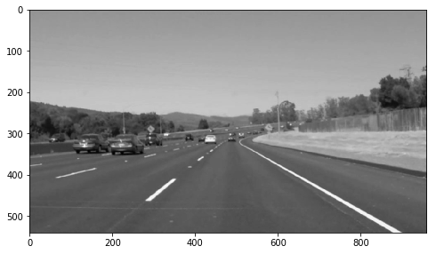
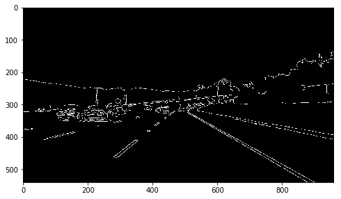
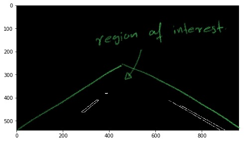
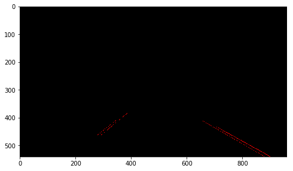
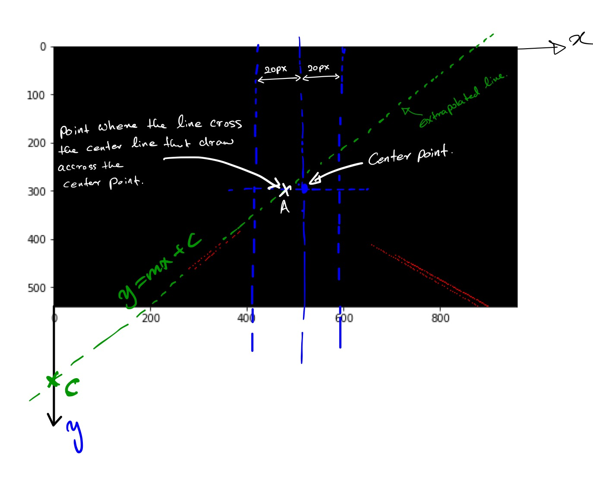
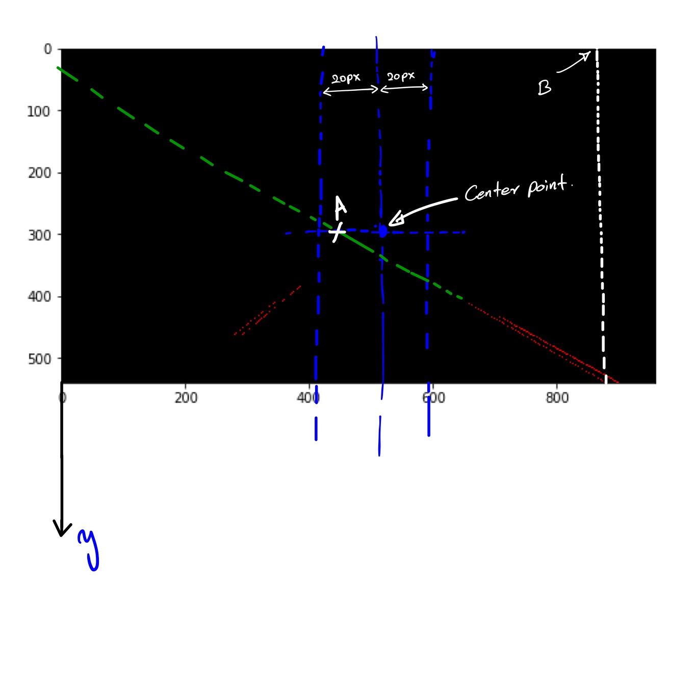
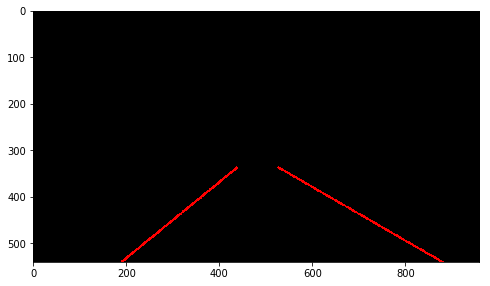
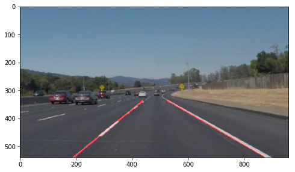

# **Finding Lane Lines on the Road** 

---

### Reflection

### 1. Pipeline description

The pipeline I have build for this project consists of following steps.In this report I will be using the following image to explain the pipleline 



- ### step 1: 
```python
imgGray = getGrayImage(image)
```

During this step, the original image has been loaded and apply the ```cv2.GaussianBlur()``` with 3x3 keynel to reduce noise in the image. The noise reduced image then convert to gray scale.


- ### step 2:
```python
imgCanny = canny(imgGray, 50, 200)
```
Apply the Canny edge detector using ```cv2.GaussianBlur()``` method with low and high threshold 50 and 200 respectively. This generates an image with edges. Trial and error basis determine the limits.



- ### step 3:
```
centerPoint = calculateCenterPoint(imgCanny)
```

Compute the center point of the image with some predefined offset. This center point later use as reference points for some calculations. 

- ### step 4:
```
imgMask = region_of_interest(imgCanny, centerPoint)
```

Block the part of the image that we are not interested in detecting Lane Lines. Lanes usually appear on the centered and bottom half of the image. This step we block out everything else but the region that lane lines appear.



- ### step 5:
```
line_img, lines = hough_lines(imgMask, 1, np.pi/180, 50, 10, 200)
```

Apply hough transform to detect lines (Lanes) in the images we narrow it down in the previous step using ```cv2.HoughLinesP()```. This method generated list of lines that are in the image.




- ### step 6:
```
leftLane, rightLane = getLaneLines(imgGray.shape[1], imgGray.shape[0], lines, centerPoint[0][0][0], centerPoint[0][0][1])
```
The step 5 give you many line segments that are detected uisng canny edge detecter. The goal is to find out the if these lines are coorelated with the actual lanes lines. Sometime if there are any other makings on the road or any other disterbances produce lines other than lanes when when using edge detecters. I have incoporated simple rule to seperate potential candiates for lanes lines from noise. The summary of the pricess:

- steps
    + check if the line is left or right depending on the line slope
    + check if the line obay following rules. collect all the lines that obay and discard the others. 
        * a left line should cross the Y axis greater than the image height (point C in the image should be below the max y), and the point A should fall between the region that defined around the center point (in the image its 20px both side of the center point)
        
        * a right line should have the x value when y = maxy less than the xmax (point B in the image), and it should cross the center point close to what we have defined (Point A in the image. same as left lane condition)
        
    + once we have left and right candidates, extrapolate each line
    + compute one left line by averaging all the left lines and compute the right lines averaging all the right lines. 
    

- ### step 7: 
```
fimg = weighted_img(final_line_img, image)
```

Overlap the original image and the lane lines to produce the final image.



### 2. Identify potential shortcomings with current pipeline

When the lane markings are visible without any distraction (noise), the pipeline produces satisfactory results; however, when there are additional making on the ground the canny edge detector pick up those lines which may contribute to the final lane line position. Another shortcoming is that all the parameters are fixed and given some conditions we might have to change them accordingly to predict lanes accurately.

Another limitation of this process is that in the video, there are some frames comes out without any predicted lines. I need to investigate this issue further. 

### 3. Possible improvements to the pipeline

There are pany improvements can be introduce to this piple line such as:
 - Compute lane lines with variable parameters. This allows us to improve the predictions of various liting and noise conditions.
 - Introduce Deep Learning technique and train a CNN with many line markings to predict lanes accurately. 
 
